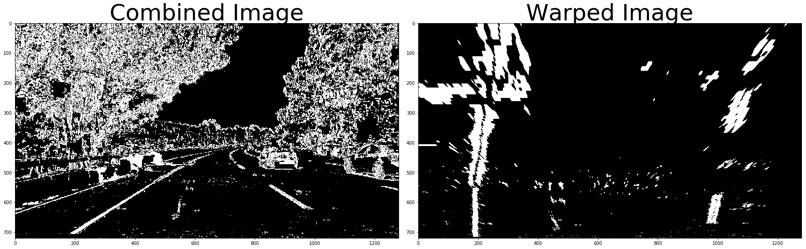

# Advanced Lane Finding
[](http://www.udacity.com/drive)


In this project, the goal is to write a software pipeline to identify the lane boundaries in an image and then in a video.

The goals / steps of this project are the following:

* Compute the camera calibration matrix and distortion coefficients given a set of chessboard images.
* Apply a distortion correction to raw images.
* Use color transforms, gradients, etc., to create a thresholded binary image.
* Apply a perspective transform to rectify binary image ("birds-eye view").
* Detect lane pixels and fit to find the lane boundary.
* Determine the curvature of the lane and vehicle position with respect to center.
* Warp the detected lane boundaries back onto the original image.
* Output visual display of the lane boundaries and numerical estimation of lane curvature and vehicle position.

## 1. Camera Calibration

In this part of the project the main aim is to calculate camera matrix and distortion coefficients.
```py
def camera_calibration():
    # read and make a list of calibration images 
    images = glob.glob("camera_cal/calibration*.jpg")

    # Array to store object points and image points
    objpoints = []    # 3D point of real world space
    imgpoints = []    # 2D point of image 
    
    # prepare object points, like (0,0,0), (1,0,0), (2,0,0) ....,(8,5,0)
    objp = np.zeros((6*9,3), np.float32)
    # The .T transposes the matrix, and the .reshape(-1,2) then reshapes it into a two-column array shape
    objp[:,:2] = np.mgrid[0:9,0:6].T.reshape(-1,2) 
    
    for image in images:
        img = cv2.imread(image)
        # convert image to grayscale
        gray = cv2.cvtColor(img, cv2.COLOR_BGR2GRAY)

        # Find the chessboard corner
        ret, corners = cv2.findChessboardCorners(gray, (9,6), None)

        # If corner are found, add object points, image points
        if ret == True:
            imgpoints.append(corners)
            objpoints.append(objp)

            # Draw and display the corners
            img = cv2.drawChessboardCorners(img, (9,6), corners, ret)
            plt.imshow(img)
  
    ret, mtx, dist, rvecs, tvecs = cv2.calibrateCamera(objpoints, imgpoints, gray.shape[::-1], None, None)
    return mtx, dist
```

Initially the object points `(objp)` is prepared in 3D space(x,y,z). After then a grid is created using opencv function `np.mgrid[0:9,0:6]` which returns the coordinate value for a given grid size. The .T transposes the matrix, and the .reshape(-1,2) then reshapes it into a two-column array shape. With the help of `glob` API we are reading all the calibration images with consistant file name. To find the corners, each image file is iterated and with the help of `cv2.findChessboardCorners` function corners are detected on a grayscaled image. If the cornes are detected then we appended points to the object and image points array. Later these object and image points are used to caliberate the camera with the help of `cv2.calibrateCamera` function, which returns the **camera matrix** and **distortion coefficient**

To undistort the image `cal_undistort()` function is used.
```py
def cal_undistort(img, mtx, dist):
#     Undistort the image
    undist = cv2.undistort(img, mtx, dist, None, mtx)
    return undist
```
This function uses the `cv2.undistort()` function and returns the undistorted image.
<br />


## 2. Pipeline for image
The pipeline of image consists of 6 steps.

### Step.1 Apply the color transforms and gradients to create a thresholded binary image.

This function combines the color tranform and gradient thresholding to get the best of both worlds.
The main aim of this function is to generate a binary image of an undistorted image.
```py
def thresholded_binary_image(img, s_thresh=(170, 255), sx_thresh=(10, 100)):

#     Convert to HLS color space
    hls = cv2.cvtColor(img, cv2.COLOR_BGR2HLS)
    
    l_channel = hls[:,:,1]    # Separate l Channel
    s_channel = hls[:,:,2]    # Separate s Channel
    
#     Take the derivative in x
    sobelx = cv2.Sobel(l_channel, cv2.CV_64F, 1, 0)
#     Absolute x derivative to accentuate lines away from horizontal
    abs_sobelx = np.absolute(sobelx)
#     Convert the absolute value image to 8-bit:
    scaled_sobel = np.uint8(255*abs_sobelx/np.max(abs_sobelx))
    
    # Threshold x gradient
    sxbinary = np.zeros_like(scaled_sobel)
    sxbinary[(scaled_sobel >= sx_thresh[0]) & (scaled_sobel <= sx_thresh[1])] = 1
    
    # Threshold color channel
    s_binary = np.zeros_like(s_channel)
    s_binary[(s_channel >= s_thresh[0]) & (s_channel <= s_thresh[1])] = 1
    # Stack each channel
    color_binary = np.dstack(( np.zeros_like(sxbinary), sxbinary, s_binary)) * 255
    
    # Combine the two binary thresholds
    combined_binary = np.zeros_like(sxbinary)
    combined_binary[(s_binary == 1) | (sxbinary == 1)] = 1
    
    return color_binary, combined_binary
```

Initially the image is converted from RGB color space to HLS color space using `cv2.cvtColor()` function. Then the `cv2.Sobel()` is used to take the derivative of l_channel image in x direction(the 1, 0 at the endenotes x direction). The absolute value of sobel is converted to 8-bit because it is useful when we have to apply a particular threshold, and we want it to work the same on input images of different scales, like jpg vs. png.
Here in the `thresholded_binary_image()` we have defined 2 more parameters s_thresh and sx_thresh. **sx_thresh** values are used for gradient thresholding whereas **s_thresh** valuse are used for color thresholding. To get the binary of each color and gradient, pixels which are in range is assigned to 1 and other they will remain 0.
To get the color_binary `np.zeros_like(sxbinary)`, `sxbinary` and `s_binary` are stacked together. And to get the combined binary(s_channel and gradient threshold), pixels where any of `s_binary` or `sxbinary` is equal to 1 is assign to 1 and remaining pixels will remain 0.


### Step.2 Perform Perspective Transform
The process of applying perspective transform is similar to applying undistortion but in this case instead of mapping object point to image point, we map the points given in an image(src) to different desired image point(dst) with new perspective. The main mathematical concept behind perspective transform is that in real world coordinates x,y, and z, the greater the magnitude of z coordinate, or distance from the camera, the smaller it will appear in a 2D image.
```py
def perspective_transform(img):
    
    img_size = (img.shape[1], img.shape[0])
    
    src = np.float32(
    [[(img_size[0] / 2) - 55, img_size[1] / 2 + 100],
    [((img_size[0] / 6) - 10), img_size[1]],
    [(img_size[0] * 5 / 6) + 60, img_size[1]],
    [(img_size[0] / 2 + 55), img_size[1] / 2 + 100]])
    dst = np.float32(
    [[(img_size[0] / 4)-100, 0],
    [(img_size[0] / 4)-100, img_size[1]],
    [(img_size[0] * 3 / 4), img_size[1]],
    [(img_size[0] * 3 / 4), 0]])
    
#     Compute the perspective transform, M, given source and destination points:
    M = cv2.getPerspectiveTransform(src, dst)
    Minv = cv2.getPerspectiveTransform(dst, src)
    
#     Warp an image using the perspective transform, M:
    warped = cv2.warpPerspective(img, M, img_size, flags=cv2.INTER_LINEAR)
    
    return M, Minv, warped
```  
Here we have defined the src(source) and dst(destintion) point of the image. Which is used by the `cv2.getPerspectiveTransform()` function to calculate the perspective and inverse perspective transform. Then `cv2.warpPerspective()` function is used to warp the image to the desired perspective.



### Step.3 View Histogram

Here the histogram is taken along all the coloumns which plots a graph of where the binary activations occur across the image.
```py
#     take a histogram along all the columns in the lower half of the image
histogram = np.sum(binary_warped[binary_warped.shape[0]//2:,:], axis=0)
    
plt.plot(histogram)
```


### Step.4 Find lane pixels
The main aim of this function is to find the lanes in a binary_warped image. Initially we started with the approach of sliding window in which-

* First we split the histogram into two sides, one for each lane line.
* In next step we set few hyperparameters related to sliding windows(nwindows, margin, minpix).
* Loop through each window in nwindows.
* Found the boundaries of current window. Which was based on a combination of the current window's starting point (leftx_current and rightx_current), as well as the margin we had set in the hyperparameters.
* Used cv2.rectangle to draw window boundaries onto our visualization image out_img.
* Now the boundaries of window is known to us, so found out which activated pixels from nonzeroy and nonzerox above actually fall into the window.
* Appended those to the lists left_lane_inds and right_lane_inds.
* If the number of pixels found are greater than the hyperparameter minpix, re-centered the window (i.e. leftx_current or rightx_current) based on the mean position of these pixels.
* Now that we have found all our pixels belonging to each line, fitted a polynomial to the line using `np.polyfit`.
* After then the result(out_img) is visualized.

The approach of sliding windows to track the lane lines out into the distance is great but it is very inefficient to use the full algorithm from before and starting fresh on every frame of the image in the video. Instead of doing so we we have used the approach to search in a margin around the previous line position. So here we have used the result of previous approach and generated a polygon to illustrate the search window area. After then used the ` cv2.fillPoly()` function to draw the lane onto to out_image.

```py
def find_lane_pixels(binary_warped, view):
    histogram = np.sum(binary_warped[binary_warped.shape[0]//2:,:], axis=0)
#     Create an output image to draw on and visualize the result
    out_img = np.dstack((binary_warped, binary_warped, binary_warped))
    
#     Find the peak of the left and right halves of the histogram
#     These will be the starting point for the left and right lines
    midpoint = np.int(histogram.shape[0]//2)
    leftx_base = np.argmax(histogram[:midpoint])
    rightx_base = np.argmax(histogram[midpoint:]) + midpoint
       
#     Hyperparameters
    nwindows = 9   # number of windows
    margin = 100   # set the width of window +/- margin
    minpix = 50    # minimum number of pixels in window
    
    #     Set height of windows - based on nwindows above and image shape
    window_height = np.int(binary_warped.shape[0]//nwindows)
    
#     Identify the x and y position of all the nonzero pixels
    nonzero = binary_warped.nonzero()
    nonzerox = np.array(nonzero[1])
    nonzeroy = np.array(nonzero[0])
    
#     current position of each window in nwindows
    leftx_current = leftx_base
    rightx_current = rightx_base
    
#     Create empty lists to receive left and right lane pixel indices
    left_lane_inds = []
    right_lane_inds = []
    
#     Step through the windows one by one
    for window in range(nwindows):
        # Identify window boundaries in x and y (and right and left)
        win_y_low = binary_warped.shape[0] - (window+1)*window_height
        win_y_high = binary_warped.shape[0] - window*window_height
        # Find the four below boundaries of the window 
        win_xleft_low = leftx_current - margin  # Update this
        win_xleft_high = leftx_current + margin  # Update this
        win_xright_low = rightx_current - margin  # Update this
        win_xright_high = rightx_current + margin  # Update this
        
        # Draw the windows on the visualization image
        cv2.rectangle(out_img,(win_xleft_low,win_y_low),
        (win_xleft_high,win_y_high),(0,255,0), 2) 
        cv2.rectangle(out_img,(win_xright_low,win_y_low),
        (win_xright_high,win_y_high),(0,255,0), 2) 
        
        #Identify the nonzero pixels in x and y within the window
        good_left_inds = ((nonzeroy >= win_y_low) & (nonzeroy < win_y_high) & 
        (nonzerox >= win_xleft_low) &  (nonzerox < win_xleft_high)).nonzero()[0]
        good_right_inds = ((nonzeroy >= win_y_low) & (nonzeroy < win_y_high) & 
        (nonzerox >= win_xright_low) &  (nonzerox < win_xright_high)).nonzero()[0]
        
        # Append these indices to the lists
        left_lane_inds.append(good_left_inds)
        right_lane_inds.append(good_right_inds)
        
        # If > minpix found  pixels, recenter next window
        if len(good_left_inds) > minpix:
            leftx_current = np.int(np.mean(nonzerox[good_left_inds]))
        if len(good_right_inds) > minpix:
            rightx_current = np.int(np.mean(nonzerox[good_right_inds]))
        
    # Concatenate the arrays of indices (previously was a list of lists of pixels)
    try:
        left_lane_inds = np.concatenate(left_lane_inds)
        right_lane_inds = np.concatenate(right_lane_inds)
    except ValueError:
        # Avoids an error if the above is not implemented fully
        pass

    # Extract left and right line pixel positions
    leftx = nonzerox[left_lane_inds]
    lefty = nonzeroy[left_lane_inds] 
    rightx = nonzerox[right_lane_inds]
    righty = nonzeroy[right_lane_inds]


    #Fit a second order polynomial to each using `np.polyfit`
    left_fit = np.polyfit(lefty, leftx, 2)
    right_fit = np.polyfit(righty, rightx, 2)

    # Generate x and y values for plotting
    ploty = np.linspace(0, binary_warped.shape[0]-1, binary_warped.shape[0] )
    try:
        left_fitx = left_fit[0]*ploty**2 + left_fit[1]*ploty + left_fit[2]
        right_fitx = right_fit[0]*ploty**2 + right_fit[1]*ploty + right_fit[2]
    except TypeError:
        # Avoids an error if `left` and `right_fit` are still none or incorrect
        print('The function failed to fit a line!')
        left_fitx = 1*ploty**2 + 1*ploty
        right_fitx = 1*ploty**2 + 1*ploty

    ## Visualization ##
    # Colors in the left and right lane regions
    out_img[lefty, leftx] = [255, 0, 0]
    out_img[righty, rightx] = [0, 0, 255]
    
#     View your output
    if (view == True):
    f, (ax1, ax2) = plt.subplots(1, 2, figsize=(24, 9))
    f.tight_layout()
    ax1.set_title('Sliding Window', fontsize=50)
    ax1.imshow(out_img)
    ax1.plot(left_fitx, ploty, color='yellow')
    ax1.plot(right_fitx, ploty, color='yellow')
    
    ## Visualization ##
    # Create an image to draw on and an image to show the selection window
    out_img = np.dstack((binary_warped, binary_warped, binary_warped))*255
    window_img = np.zeros_like(out_img)
    # Color in left and right line pixels
    out_img[nonzeroy[left_lane_inds], nonzerox[left_lane_inds]] = [255, 0, 0]
    out_img[nonzeroy[right_lane_inds], nonzerox[right_lane_inds]] = [0, 0, 255]

    # Generate a polygon to illustrate the search window area
    # And recast the x and y points into usable format for cv2.fillPoly()
    left_line_window1 = np.array([np.transpose(np.vstack([left_fitx-margin, ploty]))])
    left_line_window2 = np.array([np.flipud(np.transpose(np.vstack([left_fitx+margin, 
                              ploty])))])
    left_line_pts = np.hstack((left_line_window1, left_line_window2))
    right_line_window1 = np.array([np.transpose(np.vstack([right_fitx-margin, ploty]))])
    right_line_window2 = np.array([np.flipud(np.transpose(np.vstack([right_fitx+margin, 
                              ploty])))])
    right_line_pts = np.hstack((right_line_window1, right_line_window2))

    # Draw the lane onto the warped blank image
    cv2.fillPoly(window_img, np.int_([left_line_pts]), (0,255, 0))
    cv2.fillPoly(window_img, np.int_([right_line_pts]), (0,255, 0))
    result = cv2.addWeighted(out_img, 1, window_img, 0.3, 0)
    
#   View your output
    if (view == True):
    ax2.set_title('Search from prior', fontsize=50)
    ax2.imshow(result)
    ax2.plot(right_fitx, ploty, color='yellow')
    ax2.plot(left_fitx, ploty, color='yellow')
    
    return result, out_img, ploty, left_fit, right_fit, left_fitx, right_fitx
```


### Step.5 Calculate Curve radius and Car position.
Using equation of radius of curvature to calculate the curve radius of left and right lane.


It is assumed that the camera is mounted at the center of the car, such that the lane center is the midpoint at the bottom of the image between the two detected lines. Therefore to calculate the offset position of the car we have first calculated the difference of centre of image to the centre of the lane. The difference is then multiplied by xm_per pix(converted from pixels to meters). The result will give the position of vehicle from the centre.

```py
def measure_curvature_real(left_fit, right_fit, left_fitx, right_fitx, ploty):
    
#     Define conversions in x and y from pixels space to meters
    ym_per_pix = 30/720 # meters per pixel in y dimension
    xm_per_pix = 3.7/700 # meters per pixel in x dimension
    
    leftx = left_fitx[::-1]  # Reverse to match top-to-bottom in y
    rightx = right_fitx[::-1]  # Reverse to match top-to-bottom in y

    # Fit a second order polynomial to pixel positions in each fake lane line
    # Fit new polynomials to x,y in world space
    left_fit_cr = np.polyfit(ploty*ym_per_pix, leftx*xm_per_pix, 2)
    right_fit_cr = np.polyfit(ploty*ym_per_pix, rightx*xm_per_pix, 2)
    
    # Define y-value where we want radius of curvature
    # We'll choose the maximum y-value, corresponding to the bottom of the image
    y_eval = np.max(ploty)
    
    # Calculation of R_curve (radius of curvature)
    left_curve_radius = ((1 + (2*left_fit_cr[0]*y_eval*ym_per_pix + left_fit_cr[1])**2)**1.5) / np.absolute(2*left_fit_cr[0])
    right_curve_radius = ((1 + (2*right_fit_cr[0]*y_eval*ym_per_pix + right_fit_cr[1])**2)**1.5) / np.absolute(2*right_fit_cr[0])
    
    leftx_lane = left_fit[0]*(img.shape[0]-1)**2 + left_fit[1]*(img.shape[0]-1) + left_fit[2]
    rightx_lane = right_fit[0]*(img.shape[0]-1)**2 + right_fit[1]*(img.shape[0]-1) + right_fit[2]
    
    car_position = ((img.shape[1]/2)-((leftx_lane+rightx_lane)/2))*xm_per_pix
    
    return left_curve_radius, right_curve_radius, car_position
```
### Step.6 Final Display

The final image is displayed which is a combined result of **undistorted** image and **newwarp**.
This final image is also annotated with text written on it.

```py
def final_display(ploty, left_fitx, right_fitx, binary_warped, undistorted, left_curve_radius, right_curve_radius, car_position):
    # Create an image to draw the lines on
    warp_zero = np.zeros_like(binary_warped).astype(np.uint8)
    color_warp = np.dstack((warp_zero, warp_zero, warp_zero))

    # Recast the x and y points into usable format for cv2.fillPoly()
    pts_left = np.array([np.transpose(np.vstack([left_fitx, ploty]))])
    pts_right = np.array([np.flipud(np.transpose(np.vstack([right_fitx, ploty])))])
    pts = np.hstack((pts_left, pts_right))

    # Draw the lane onto the warped blank image
    cv2.fillPoly(color_warp, np.int_([pts]), (0,255, 0))

    # Warp the blank back to original image space using inverse perspective matrix (Minv)
    newwarp = cv2.warpPerspective(color_warp, Minv, (img.shape[1], img.shape[0])) 
    # Combine the result with the original image
    final = cv2.addWeighted(undistorted, 1, newwarp, 0.3, 0)
    
#     Write text on image
    font = cv2.FONT_HERSHEY_SIMPLEX
    text = "Left curve radius: {:.2f} m".format(left_curve_radius)
    cv2.putText(final, text, (50,50), font, 1, (255,255,255), 2)
    text = "Right curve radius: {:.2f} m".format(right_curve_radius)
    cv2.putText(final, text, (50,100), font, 1, (255,255,255), 2)
    text = "Vehicle is {:.2f} m Right from center".format(car_position)
    cv2.putText(final, text, (50,150), font, 1, (255,255,255), 2)
    
    return final 
final = final_display(ploty, left_fitx, right_fitx, binary_warped, undistorted, left_curve_radius, right_curve_radius, car_position)
plt.imshow(final)
```


## Pipeline for video

In this pipeline all the above defined function are called in a single function whose result will be applied on the video(series of images).

```py
def process_image(img):
    #video pipeline
    
    # Undistort Image
    undistorted = cal_undistort(img, mtx, dist)

    # Generate binary image
    color_binary, combined_binary = thresholded_binary_image(undistorted)
    
    # Calculate perspective transform
    M, Minv, binary_warped = perspective_transform(combined_binary)
    
    # find lane pixels
    result, out_img, ploty, left_fit, right_fit, left_fitx, right_fitx = find_lane_pixels(binary_warped, False)

    # Calculate Curve radius
    left_curve_radius, right_curve_radius, car_position = measure_curvature_real(left_fit, right_fit, left_fitx, right_fitx, ploty)

    # Display final image
    final = final_display(ploty, left_fitx, right_fitx, binary_warped, undistorted, left_curve_radius, right_curve_radius, car_position)
    return final

# Import everything needed to edit/save/watch video clips
project_video_output = ('challenge_video_output.mp4')
clip1 = VideoFileClip("challenge_video.mp4")
white_clip = clip1.fl_image(process_image)
%time white_clip.write_videofile(project_video_output, audio=False)
```

The output video will get saved in the project directory with name ***project_output_video*** and will look like this- 
<br />


## Discussion

### Problems/issues faced

* It takes lot of time to check the result on different parameters, specially in case of video.
* Earlier in case of shadow the output was not desirable but later it was improved.  

### Improvements

* The output results can be improved by more fine tuning of color and gradient parameters.
* Choosing better `src` and `dst` (region masking) could leads to a better result.